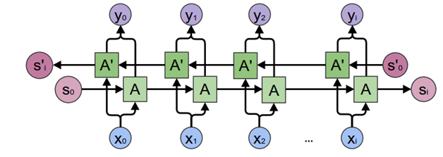
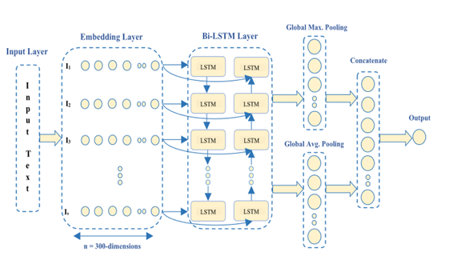
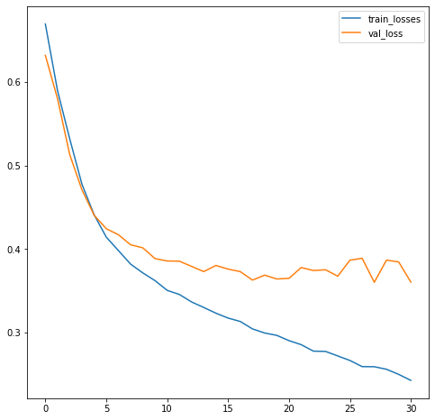
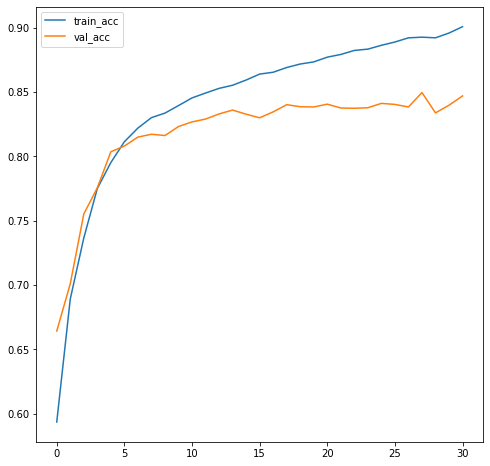
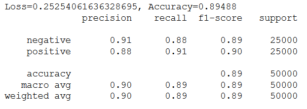
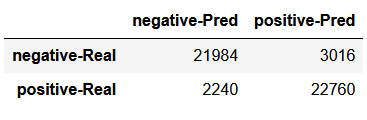

# Sentiment Analysis of IMDB dataset
NLP or Natural Language Processing is the field of study that focuses on the interactions between human language and computers (i.e to convert language text into suitable numerical form over which a machine learning model could make inference). One subproblem of NLP is sentiment analysis, i.e classifying a statement as positive or negative. 
In this project I have used pytorch bi-directional LSTM  to predict the sentiments of Movie Reviews present in IMDB database.

## Dataset Description
IMDB dataset contains 50000 movie reviews, each review is given label of positive or negative based on its sentiment. The a dataset consist of 25,000 positive and 25,000 negative review samples.

The columns in this dataset are:
* review
* sentiment

## Model Architect
### Bi-directional LSTM

### model

### hyperparameters
* Optimizer: Adam
* Learning Rate: 0.0001
* Loss Function: Cross Entropy
* Batch Size: 64
* Sentence Max length: 250
* Epochs: 30
* LSTM layers: 1
* LSTM hidden size: 128
* Dropout: 0.3
* Embedding Dimension (glove-50d word2vec): 50
* Total number of unique words: 15000 

## Results
The model is trained for 30 epochs on the training set (45000 samples) and One tenth of dataset (5000 samples) is used for validation.

### Training and Validation Loss

### Training and Validation Acuuracy

** Since epoch 28 has least validation loss hence it is used as model weight **

### Precision Recall and other Metrics

### Confusion Matrix
